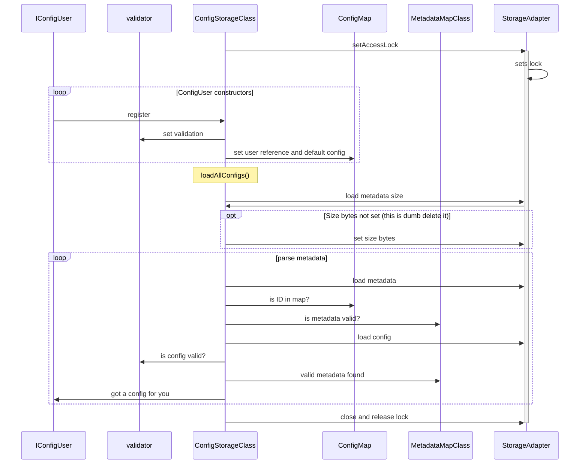
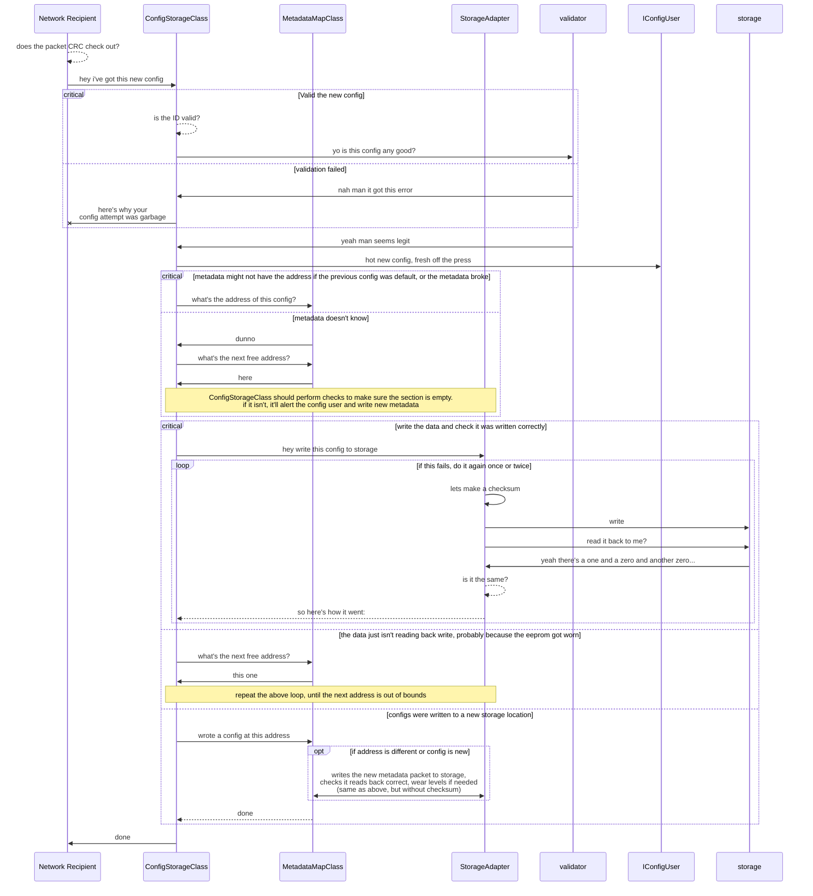

# Diagrams

some diagrams i'm using to design this app. these are more for design purposes, so not necessarily accurate

## Configs

### Config File Structure

0-1: Metadata reservation size - 2 complimentary bytes indicating the number of metadata packets that can be stored in the metadata reservation. byte 0 is the size, byte 1 is ~size, therefore ([0] & [1] == 0) and ([0] xor [1] == ~0). once set, they should never change, so if they do not match, data has not been set. also, if the project is updated to include new config types that a device doesn't need, the device will still be able to parse it's stored data

2-metaEnd: Metadata reservation - metaEnd = 2 + (Metadata reservation size) * (Metadata packet size)

metaEnd-EOF: config packet reservation

### Config Storage Class construction process

### writing configs

